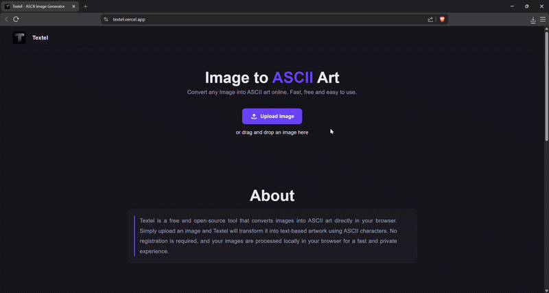

  

# Textel

Convert images into ASCII art directly in your browser.

## Features

- Image to ASCII conversion
- Instant preview
- Download ASCII output
- Responsive design
- No server required
- Privacy-friendly

## Demo

## How It Works

1. Upload an image.
2. Textel analyzes image brightness values.
3. Pixels are mapped to ASCII characters.
4. The generated ASCII art is displayed instantly.
5. Download the result.

## Tech Stack

- HTML5
- CSS3
- JavaScript
- Canvas API
